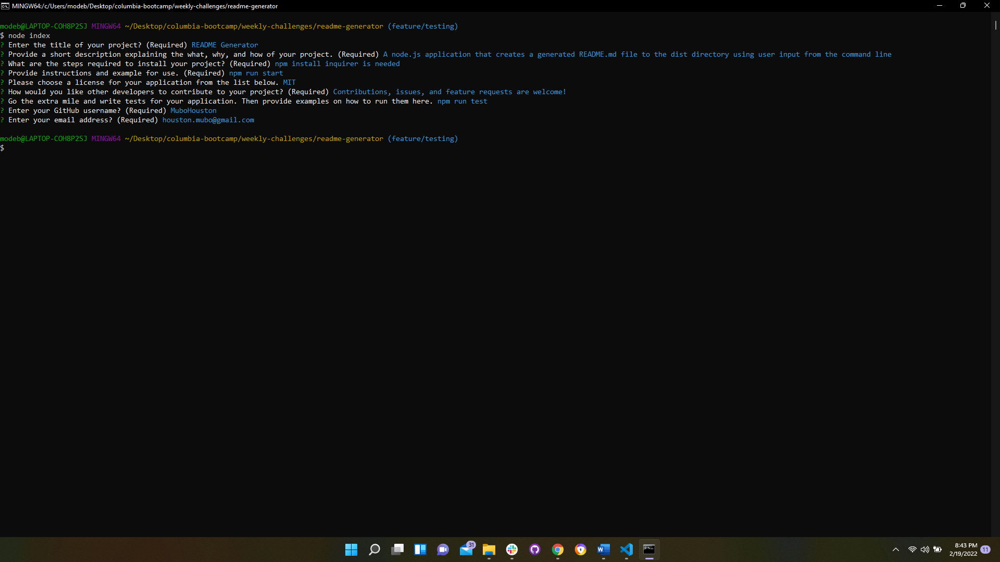
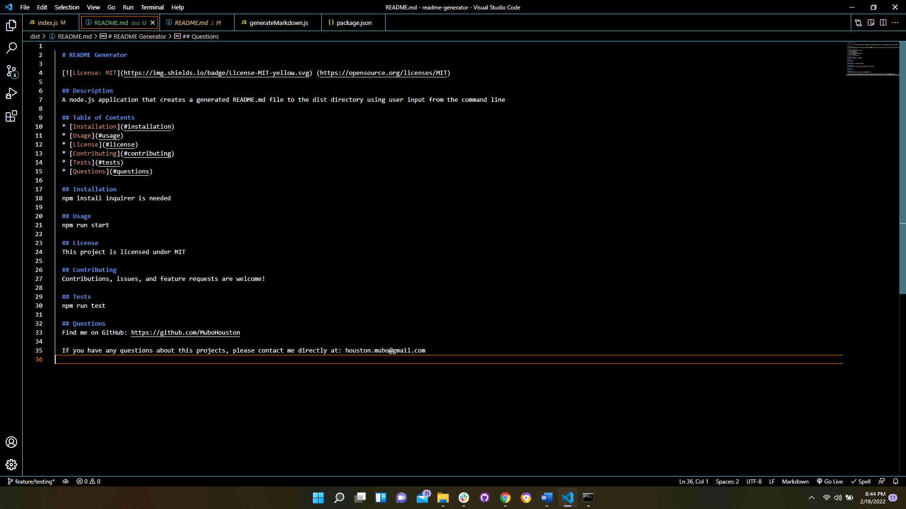
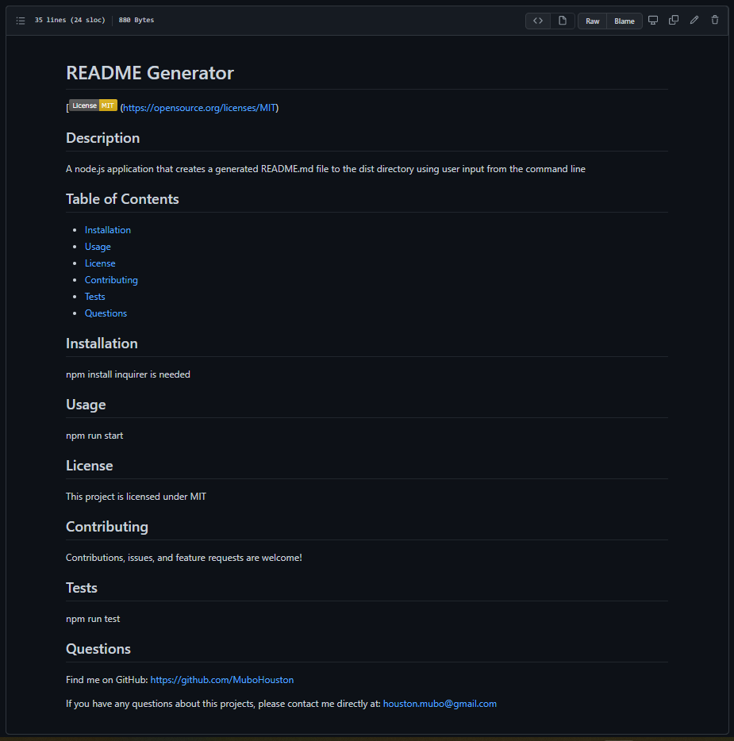

<h1 align="center"> Welcome to Professional README Generator</h1>

## Description 
This is a command line application that dynamically generates a professional README.md file from a user's input using the Inquirer package.


## Demo
Video of the typical user flow

 

<a href="https://drive.google.com/file/d/1Q8v1EkkSKjQsu0LVQOpSqmYRBDtYymmE/view">Link to walk-through video</a>

(For better quality, download video from the link above)

User's input from the command line



README generated on Visual Studio Code
 


README generated in GitHub




## Installation 

1. Clone the repository

```bash
git clone https://github.com/MuboHouston/README-generator.git
```

2. Change the working directory

```bash
cd README-generator
```

3. Install dependencies

```bash
npm install
```

4. Run the app

``` bash 
npm start
```


## Contribution

Contributions, issues, and feature requests are welcome!

## Author

Mubo Houston

- GitHub: [@MuboHouston](https://github.com/MuboHouston)